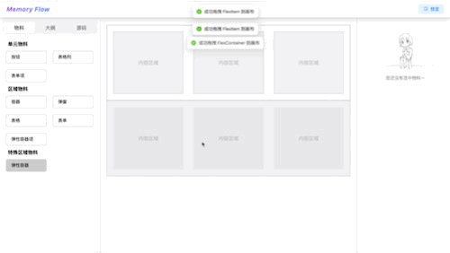

# Memory Flow

## 🌟 介绍
> Memory Flow 是一个基于React + Typescript + Zustand 的低代码编辑器，用于减少重复造轮子（Maybe），目前正在开发中～

## 📚 预览


## ✨ 使用文档
``` javascript
npm install
npm run dev
```

## 🚀 开发文档

### 安装 Memory CLI
``` javascript
npm install linmo-cli -g
```

### 生成物料模版
``` javascript
memory create [materialName]
```

### 物料类别
``` javascript
// 物料类型
type MaterialType = 'unit' | 'area' | 'special'

// unit ---- 单元级物料，如Button,Input
// area ---- 区域级物料，如Page,Container
// special ---- 特殊物料，如FormItem只能投放在Form内
```

### 物料配置
``` typescript
// 物料会生成dev和prod，用于编辑状态和预览状态
ComponentConfig = {
    name: "test",  // 组件名称
    defaultProps: {},  // 默认属性，可以根据需求进行配置
    setter: [],  // 设置器，如果有需要的设置器可以添加
    desc: "test 组件描述",  // 组件的描述，可以根据具体情况进行修改
    stylesSetter: [],  // 样式设置器，可以根据需求进行添加
    dev: {},  // 编辑环境配置，可以根据需要添加
    prod: {},  // 预览环境配置，可以根据需要添加
    events: [],  // 事件，可以添加具体的事件对象
    methods: []  // 方法，可以添加具体的组件方法
}
```

### 注册物料
```typescript
// editor/stores/component-config
componentConfig: {
        Container: ContainerConfig,
        Button: ButtonConfig,
        Page: PageConfig,
        Modal: ModalConfig,
        Table: TableConfig,
        TableColumn: TableColumnConfig,
        Form: FormConfig,
        FormItem: FormItemConfig,
        new: newConfig
    }
```
